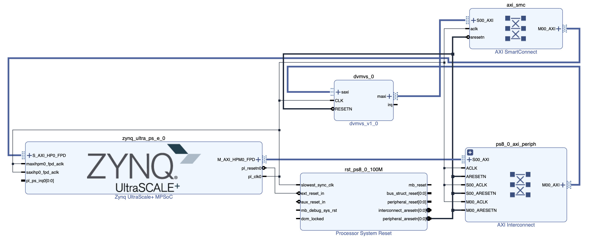
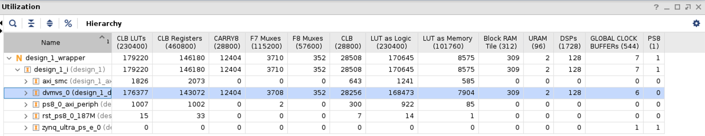
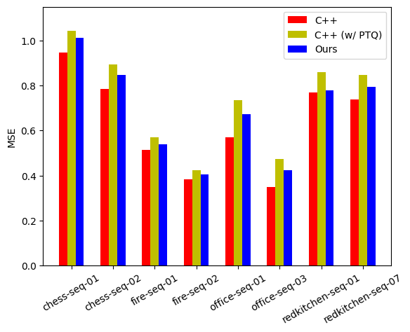

# FADEC

**FPGA-based Acceleration of Video Depth Estimation by HW/SW Co-design**

Copyright 2022, Nobuho Hashimoto and Shinya Takamaeda-Yamazaki


# License

[Apache License 2.0](http://www.apache.org/licenses/LICENSE-2.0)


# Summary

TBD


# Procedure

1. Prepare pre-trained weights and datasets
1. Adjust datasets to our implementation
1. Quantize weights and activation
1. Export network input and output
1. Export HDL
1. Generate bitstream
1. Execute FADEC on ZCU104
1. Evaluate results


## Settings

### 1st to 4th

- Python 3.8.12
    - numpy==1.20.3
    - opencv-contrib-python==4.5.4.60
    - path==15.0.0
    - torch==1.5.1+cu101
    - torchvision==0.6.1+cu101


### 5th

- Python 3.8.2
    - nngen==1.3.3
    - numpy==1.22.3
    - onnx==1.11.0
    - pyverilog==1.3.0
    - torch==1.11.0
    - veriloggen==2.1.0

Note: The environment is changed from "1st to 4th" because we used different machines.


### 6th

- Vivado v2021.2


### 7th and 8th

- **ZCU104** board with Zynq UltraScale+ MPSoC XCZU7EV-2FFVC1156 from Xilinx
    - PYNQ Linux 2.6, based on Ubuntu 18.04 (GNU/Linux 5.4.0-xilinx-v2020.1 aarch64)
    - Python 3.6.5
        - Cython==0.29
        - numpy==1.16.0
        - torch==1.10.2
    - g++ (Ubuntu/Linaro 7.3.0-16ubuntu3) 7.3.0 (for the 8th)
        - OpenCV v3.4.3 C++
        - Eigen v3.3.4


## 1. Prepare pre-trained weights and datasets

- Download the pre-trained weights from [ardaduz/deep-video-mvs/dvmvs/fusionnet/weights](https://github.com/ardaduz/deep-video-mvs/tree/master/dvmvs/fusionnet/weights).
- Place it under [`./dev/params`](./dev/params/).
    - The directory name should be changed from `weights` to `org_weights`.
    - The path should be `./dev/params/org_weights`.
- Download the `hololens` dataset from [ardaduz/deep-video-mvs/sample-data/hololens-dataset](https://github.com/ardaduz/deep-video-mvs/tree/master/sample-data/hololens-dataset).
- Place it under [`./dev/dataset`](./dev/dataset).
    - The path should be `./dev/dataset/hololens-dataset`.
- Download the `7scenes` dataset from [
RGB-D Dataset 7-Scenes](https://www.microsoft.com/en-us/research/project/rgb-d-dataset-7-scenes/).
- Unzip the files.
    - Note: We just use the following eight scenes: `redkitchen/seq-01`, `redkitchen/seq-07`, `chess/seq-01`, `chess/seq-02`, `fire/seq-01`, `fire/seq-02`, `office/seq-01`, `office/seq-03`.
- Set the downloaded 7scenes path to the `input_folder` variable in [`./dev/dataset/7scenes_export.py`](./dev/dataset/7scenes_export.py).
- Execute the script by the following command.

    ```bash
    $ cd dev/dataset
    $ python3 7scenes_export.py
    ```


## 2. Adjust datasets to our implementation

- Execute [`./dev/dataset_converter/hololens/convert_hololens.py`](./dev/dataset_converter/hololens/convert_hololens.py) and [`./dev/dataset_converter/7scenes/convert_7scenes.py`](./dev/dataset_converter/7scenes/convert_7scenes.py) by the following commands.

    ```bash
    $ cd dev/dataset_converter/hololens
    $ python3 convert_hololens.py
    $ cd ../7scenes
    $ python3 convert_7scenes.py
    ```

    - Outputs will be stored in `hololens/images`, `7scenes/data_images`, and `7scenes/data_7scenes`.


## 3. Quantize weights and activation

TBD


## 4. Export network input and output

TBD


## 5. Export HDL

TBD


## 6. Generate bitstream

- Execute [`./dev/vivado/generate_bitstream.sh`](./dev/vivado/generate_bitstream.sh) by the following commands.

    ```sh
    $ cd dev/vivado
    $ ./generate_bitstream.sh
    ```

    - Outputs will be stored in `./dev/vivado/dvmvs`.
    - Note: It will take some hours to finish.
- The design image is shown in the figure below.

    


## 7. Execute FADEC on ZCU104

- Prepare datasets by following the 1st and 2nd procedures if necessary.
- Download and place `flattened_params` under [`./eval/fadec`](./eval/fadec) from [flattened_params.zip](https://projects.n-hassy.info/storage/fadec/flattened_params.zip) if necessary.
- Place [`./eval/fadec`](./eval/fadec) on ZCU104.
- Place `design_1.bit` and `design_1.hwh` in `fadec` directory on ZCU104.
    - [`./dev/vivado/move_bitstream.sh`](./dev/vivado/move_bitstream.sh) is helpful to find and move these files.

        ```sh
        $ cd dev/vivado
        $ ./move_bitstream.sh /path/to/vivado_project_directory pynq:/path/to/fadec
        # The project directory would be "./dev/vivado/dvmvs" by default.
        # You can also specify a remote directory for the project directory.
        ```

    - You can also download these files from [design_1.zip](https://projects.n-hassy.info/storage/fadec/design_1.zip)
- Compile [`./eval/fadec/fusion.pyx`](./eval/fadec/fusion.pyx) on ZCU104 by the following commands.

    ```bash
    $ cd /path/to/fadec
    $ make
    ```

- Execute [`./eval/fadec/7scenes_evaluation.ipynb`](./eval/fadec/7scenes_evaluation.ipynb) on ZCU104.
    - Outputs will be stored in [`depths`](./eval/fadec/depths) and [`time_fadec.txt`](./eval/fadec/time_fadec.txt).
    - If the following error happens in the 7th cell, reboot ZCU104 and retry.

        ```
        Output exceeds the size limit. Open the full output data in a text editor
        ---------------------------------------------------------------------------
        RuntimeError                              Traceback (most recent call last)
        <ipython-input-7-6778394090c9> in <module>()
            1 memory_size = 1024 * 1024 * 192
        ----> 2 buf = allocate(shape=(memory_size,), dtype=np.uint8)
            3 buf[param_offset:param_offset + params.size] = params.view(np.int8)

        /usr/local/lib/python3.6/dist-packages/pynq/buffer.py in allocate(shape, dtype, target, **kwargs)
            170     if target is None:
            171         target = Device.active_device
        --> 172     return target.allocate(shape, dtype, **kwargs)

        /usr/local/lib/python3.6/dist-packages/pynq/pl_server/device.py in allocate(self, shape, dtype, **kwargs)
            292
            293         """
        --> 294         return self.default_memory.allocate(shape, dtype, **kwargs)
            295
            296     def reset(self, parser=None, timestamp=None, bitfile_name=None):

        /usr/local/lib/python3.6/dist-packages/pynq/xlnk.py in allocate(self, *args, **kwargs)
            255
            256         """
        --> 257         return self.cma_array(*args, **kwargs)
            258
            259     def cma_array(self, shape, dtype=np.uint32, cacheable=0,
        ...
        --> 226             raise RuntimeError("Failed to allocate Memory!")
            227         self.bufmap[buf] = length
            228         return self.ffi.cast(data_type + "*", buf)

        RuntimeError: Failed to allocate Memory!
        ```


## 8. Evaluate results

- Prepare datasets by following the 1st and 2nd procedures if necessary.
- Download and place `params_cpp` under [`./eval/cpp`](./eval/cpp) from [params_cpp.zip](https://projects.n-hassy.info/storage/fadec/params_cpp.zip) if necessary.
- Download and place `params_cpp_with_ptq` under [`./eval/cpp_with_ptq`](./eval/cpp_with_ptq) from [params_cpp_with_ptq.zip](https://projects.n-hassy.info/storage/fadec/params_cpp_with_ptq.zip) if necessary.
- Place [`./eval/cpp`](./eval/cpp) and [`./eval/cpp_with_ptq`](./eval/cpp_with_ptq) on ZCU104.
    - Be careful that `images_7scenes` directory in those directories may be **too large to place on ZCU104**.
    - If you cannot place all the data together, place some of the directories in `images_7scenes` on ZCU104.


### Execution Time

- Execute C++ implementations by the following commands on ZCU104.

    ```bash
    $ cd /path/to/cpp
    $ make
    $ ./a.out > time_cpp.txt
    $ cd /path/to/cpp_with_ptq
    $ make
    $ ./a.out > time_cpp_with_ptq.txt
    ```

    - Outputs will be stored in `results_7scenes` and (`time_cpp.txt` or `time_cpp_with_ptq.txt`).
- Execute [`./eval/calculate_time.py`](./eval/calculate_time.py) by the following commands.

    ```bash
    $ cd /path/to/eval
    $ python3 calculate_time.py
    ```

    - The execution time per frame is shown in the table below.

        | Platform          | median [s] | std [s] |
        | ----------------- | ---------: | ------: |
        | CPU-only          | 16.744     | 0.049   |
        | CPU-only (w/ PTQ) | 13.248     | 0.035   |
        | PL + CPU (ours)   | **0.278**  | 0.118   |

    - Note: The results in this project have some measurement errors compared with those in the paper.

- Execute [`./eval/fadec/overhead_evaluation.ipynb`](./eval/fadec/overhead_evaluation.ipynb) on ZCU104 to measure the overhead time.
    - The overhead is **4.7 ms**.
    - The final cell shows the overhead time.
    - Note: The results in this project have some measurement errors compared with those in the paper.

- See `Open Implemented Design > Timing > Clock Summary` in Vivado to check the clock frequency.

    

    - The frequency is **187.512 MHz**.


### Hardware Resources

- Run `Open Implemented Design > Report Utilization` in Vivado.

    

    - The hardware resource utilization is shown in the table below.

        | Name  | #Utilization | Available | Utilization [%] |
        | ----- | -----------: | --------: | --------------: |
        | Slice | 28256        | 28800     | **98.1**        |
        | LUT   | 176377       | 230400    | 76.6            |
        | FF    | 143072       | 460800    | 31.0            |
        | DSP   | 128          | 1728      | 7.41            |
        | BRAM  | 309          | 312       | **99.0**        |


### Accuracy

- Execute [`./eval/calculate_errors.py`](./eval/calculate_errors.py) by the following commands.

    ```bash
    $ cd /path/to/eval
    $ python3 calculate_errors.py
    ```

    - The MSE values for each scene and implementation are printed.

        ```
        Dataset Nemes:  ['chess-seq-01', 'chess-seq-02', 'fire-seq-01', 'fire-seq-02', 'office-seq-01', 'office-seq-03', 'redkitchen-seq-01', 'redkitchen-seq-07']
        MSE:
                         C++:  [0.95 0.78 0.51 0.38 0.57 0.35 0.77 0.74]
                C++ (w/ PTQ):  [1.04 0.89 0.57 0.42 0.73 0.48 0.86 0.85]
                        Ours:  [1.01 0.85 0.54 0.4  0.67 0.42 0.78 0.79]
        ```

    - The graph will be saved in [`./eval/errors.png`](./eval/errors.png).

        


# Reference

```
@inproceedings{Duzceker_2021_CVPR,
    author    = {Duzceker, Arda and Galliani, Silvano and Vogel, Christoph and
                 Speciale, Pablo and Dusmanu, Mihai and Pollefeys, Marc},
    title     = {DeepVideoMVS: Multi-View Stereo on Video With Recurrent Spatio-Temporal Fusion},
    booktitle = {Proceedings of the IEEE/CVF Conference on Computer Vision and Pattern Recognition (CVPR)},
    month     = {June},
    year      = {2021},
    pages     = {15324-15333}
}
```